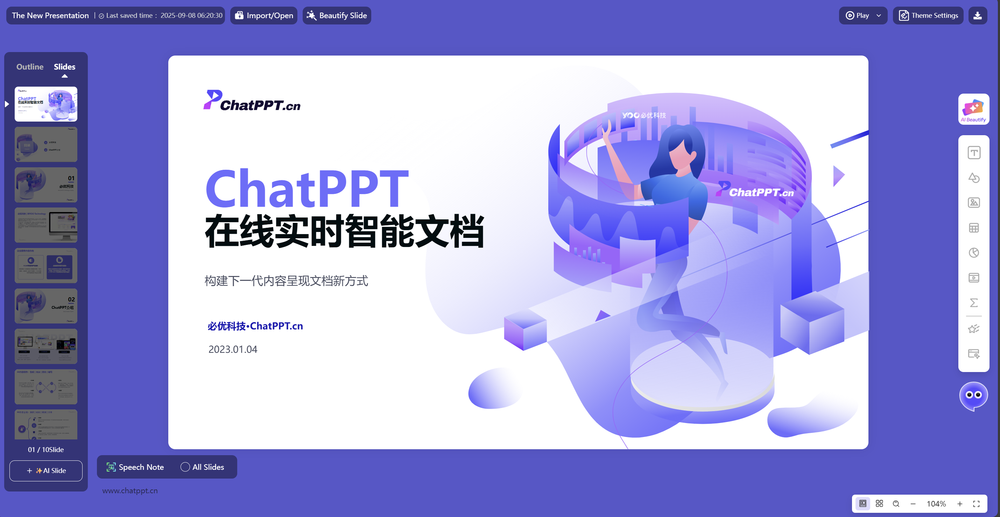
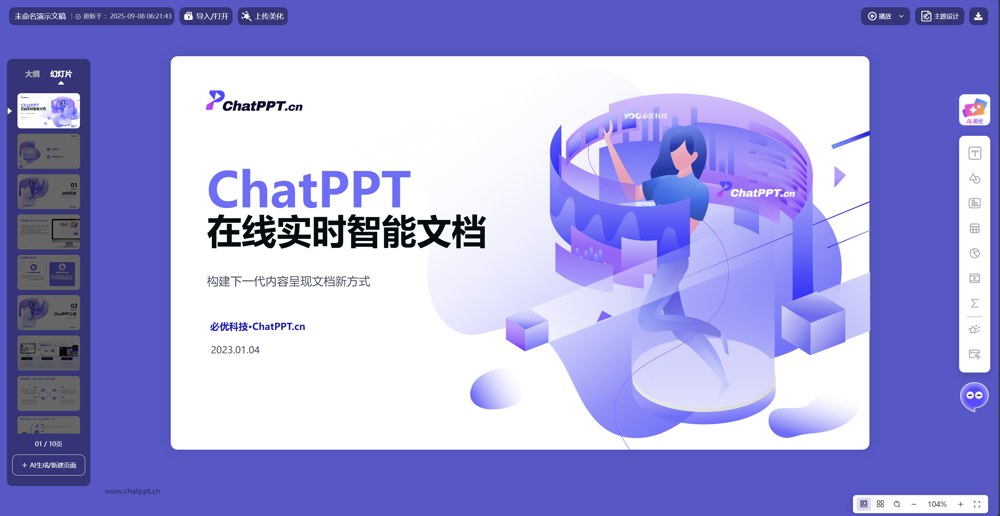

<p align="center">

</p>

<p align="center"><span style="font-size: 40px; font-weight: bold;">OpenPPT</span><br><span style="font-size: 14px;color:#646464; ">Powerby ChatPPT</span></p>
<h5 align="center"></h5>
<p align="center">
  简体中文 | <a href="./README_en.md">English</a>
</p>
<p align="center">
    <a href="https://open.chatppt.cn?channel=github-openppt" target="_blank">🔗在线体验</a>
    <span>&nbsp;&nbsp;•&nbsp;&nbsp;</span>
    <a href="#-核心功能" target="_blank">📝功能介绍</a>
    <span>&nbsp;&nbsp;•&nbsp;&nbsp;</span>
    <a href="https://www.chatppt.cn" target="_blank">🌏官方网站</a>
    <span>&nbsp;&nbsp;•&nbsp;&nbsp;</span>
    <a href="#-商业合作">💬合作交流</a>
</p>


# ✨ OpenPPT
> OpenPPT，一款基于Web化服务的在线演示文稿的智能PPT应用，旨在通过在线化网页打造Office幻灯片的全流程创作服务。支持PPT创作从空白新建（导入/AI生成）、编辑（文本/线条/形状/图片/图片/表格/图表/公式/网页/备注等）、美化排版、播放、演讲、动画展示，到导出下载全流程的服务；而且在文档格式上兼容包括微软、金山WPS、OpenOffice等主流Office产品，可以轻松实现将主流Office文档文件，一键导入转换为在线文档，同时也可以支持将在线创作的内容导出为Office格式。同时，产品将包括AI生成、AI辅写、AI演讲、AI排版美化等特色智能服务深度集成在应用中，可以便于用户轻松体验智能化办公服务。
 
 > 项目核心服务来源自产品 [ChatPPT](www.chatppt.cn) ，且项目将持续跟进其迭代版本，即从核心功能与体验上，都将尽可能实现对齐和开源化升级，故请持续关注与随时提出你的项目要求。

<b>👉示例体验：[https://open.chatppt.cn](https://open.chatppt.cn?channel=github-openppt)</b>

---

# 💻 产品界面
产品可以同时支持PC电脑与手机移动端，以下是开源版部分产品截图。
<p align="left">🎉PC端🎉</p>

编辑器

播放视图


<p align="left">🎉移动端🎉</p>


---
# 📚 核心功能
## 1️⃣ 生成（新建/导入)
### 1. PPT文档
- 导入文件（上传本地pptx文件，兼容率在93%以上）
- 新建文件（空白） 
- AI生成文档（AI输入主题生成PPT文档）
### 2. 幻灯片页
- 新增空白（右键、Enter）
- 从模板创建
### 3. 页面元素
- AI图片：当前版本仅开放了AI生成图片元素（自动根据页面内容进行配图与生成）


## 2️⃣ 编辑
### 1. PPT文档
- 主题设置（主题字体、主题色）
- 默认样式（文本样式、图形样式）
- 尺寸设置（16:9，以及自定义）
### 2. 幻灯片页
- 添加、删除、顺序（拖拽）
- 复制/粘贴/剪切
- 页面分节（增加/删除/重命名）
- 重置清空
- 背景设置（背景色/背景图片/背景渐变）
### 3. 页面元素
#### 📝元素编辑（文本/线条/形状/图片/图片/表格/图表/视频/音频/公式/网页/备注）
- 添加、删除、移动
- 复制、粘贴
- 浮动工具栏（快捷入口）
- 元素位置
- 元素大小、锁定纵横比
- 元素角度
- 元素选择（框选、点选、Ctrl多选）
- 组合、取消组合
- 批量编辑
- 元素锁定
- 吸附对齐（拖拽吸附）
- 层级：向上/向下/置顶/置底
- 对齐对画布、元素对齐（上/下/左/右/水平居中/垂直居中）
- 均匀分布：水平均匀/垂直均匀
- 翻转：水平翻转、垂直翻转
- 超链接：链接到网页、链接幻灯片页
- 文本样式
- 形状样式
- 线条样式
- 文本格式刷
- 图形格式刷
- AI辅写：润色/精炼/续写/扩写/翻译

#### 🧾文本属性（文本/形状/表格/）
- 文本设置：字体（中文字体/西文字体）、字号、颜色、高亮背景色
- 基础样式：加粗、倾斜、下划线、删除线、角标、行内代码、引用
- 文本对齐：左对齐/右对齐/居中对齐/分散对齐
- 段落符号：符号样式、序号样式
- 段落缩进：增加/减少
- 段落样式：首行缩进
- 段落对齐：靠上、靠下、垂直居中
- 文本间距：行间距、段间距（段前、段后）、字间距
- 文本框设置：溢出时缩排文本、根据文字调整文本框

#### 🩰形状样式（文本/形状）
- 填充色：颜色、透明度、类型（纯色、渐变、图片）
- 渐变设置：渐变角度、渐变点、渐变颜色、渐变方式（线性渐变、径向渐变）
- 图片填充：图片设置、填充方式（拉伸平铺）
- 边框类型：无、实线边框、虚线边框
- 透明度：元素透明度
- 自定义绘制形状
- 更改形状（预设形状、本地SVG、在线SVG、SVG代码）
- 形状文字
- 控制点（特殊预设类型）

#### 🪒边框样式（文本/线条/形状/图片/图片/表格）
- 边框样式：无、实线边框、虚线边框
- 边框线条：纯色线条、渐变线条
- 线条渐变：渐变角度、渐变点、渐变颜色
- 透明度：元素透明度


#### ➰线条样式（线条/形状）
- 线条样式：无、实线边框、虚线边框 
- 起点样式：无、圆点、箭头
- 终点样式：无、圆点、箭头
- 线条颜色
- 线条宽度
- 线条方式：直线、折线、连接符、曲线


#### 🔰阴影样式（文本/线条/形状/）
- 阴影类型：开启阴影
- 水平阴影
- 垂直阴影
- 模糊距离
- 阴影颜色：颜色与透明度


#### 🌇图片样式（图片）
- 图片库（来自在线图库）
- 上传本地图片
- 裁剪图片：自定义
- 裁剪形状：预设形状、自定义、裁剪比例
- 图片翻转：水平/垂直
- 图片着色：颜色/透明度
- 图片滤镜：模糊、亮度、对比度、灰度、饱和度、色相、不透明度
- 图片设置为背景
- 图片重置
- 图片圆角

#### 📅表格样式（表格）
- 插入表格（指定行列）、插入行、插入列
- 删除行列
- 表格样式：三线表/普通表
- 表格背景：透明表格、填充表格
- 表格强调：首行、首列、最后一行、最后一列
- 单元格设置：合并/取消合并
- 单元格文本（字体、字号、颜色、背景色、文本样式）
- 单元格数据录入
- 线框设置

#### 📉图表样式（图表）
- 图表类型设置：柱形图、条形图、折线图、面积图、饼状图、环形图
- 堆积设置
- 系列颜色：设置、增加多色系
- 标签设置：位置、显示（值、类别名称、百分比）
- 图例位置
- 使用平滑线
- 图表背景颜色：无背景/颜色设置
- 数据编辑

#### 📺视频样式（视频）
- 视频库：在线视频库（支持插入、预览） 
- 上传本地视频
- 解析在线视频
- 视频封面设置
- 重置视频封面
- 播放设置：自动播放
- 更改视频
- 播放视频：自动播放、循环播放、倍速、声音

#### 💽音频样式（音频）
- 音频库：在线视频库（支持插入、预览） 
- 上传本地音频
- 解析在线音频
- 图标设置（预设形状）
- 图标颜色
- 播放设置：自动播放、循环播放
- 更改音频

#### ♓公式样式（公式）
- 公式库：预设与常见公式库
- 自定义公式：LaTex公式
- 公式颜色
- 公式文本绘制宽度
- 更改公式

#### 🌏交互网页样式（网页）
- 交互网页库：在线示例网页
- 网页地址
- 网页外框样式：无、浏览器、电脑、手机
- 交互方式：嵌入交互、点击弹出交互
- AI生成网页：实时输入与生成


## 3️⃣ 美化排版
### 1. 上传文件美化
- 上传本地ppt文件进行智能美化排版
### 2. 全文排版美化
- 全文实时预览排版
- 支持保留主题色、启用实时深度美化、支持AI实时绘图
- 点击即全文应用

### 3. 单页排版美化
- 单页实时预览排版
- 自动跟随主题色
- 启用实时深度美化：支持手动切换页面类型
- 支持AI实时绘图

## 4️⃣ 播放
### 1. 演示播放
- 视图播放：普通视图/演讲者视图
- 页面切换动画
- 演讲模式（点击式、聚焦式）
- 缩略图导航
- 演讲备注
- 倒计时（计时模式、倒计时、显示数字）
- 激光笔
- 画笔工具（画笔、颜色、荧光笔、擦除）
- 黑白背景
- 循环播放、自动播放
- 全屏模式/非全屏播放
- 保存播放参数

### 2. 视图切换
- 普通视图
- 缩略图浏览视图
- 内容溯源视图


## 5️⃣ 演讲
### 1. 备注
- 添加页面备注

### 2. 演讲稿
- AI生成演讲（单页、全文）


## 6️⃣ 动画
### 1. 创作动画
- 交互动画
- 交互元素

### 2. 交互网页
- 网页设置
- 交互方式（播放视图下）

## 7️⃣ 导出下载
### 1.导出文件
- 导出PDF、长图
- 导出pptx文件（兼容Office软件，93%以上兼容率）
## 2.发布分享（待开放）
- 分享共享页（在线分享、共享编辑）
- 发布路演页（实时路演）


## 8️⃣ 移动端
### 📱基础服务类
#### 1. 文档编辑
- PPT文档
    - 视图：浏览视图、编辑视图、播放视图
    - 上传美化PPT（一键上传本地文件美化PPT）
- 幻灯片页面：
    - 增加、删除、复制、移动
    - Redo/Undo
    - 页面背景：纯色、图片（本地图片）
    - AI排版（单页排版/全文排版）
- 页面元素：
    - 基础编辑：复制、删除、超链接
    - 元素增加：文本、形状（预设）、图片
    - 演讲备注
    - 文本样式：字体、颜色、字号（指定、微调）、背景色、样式（加粗、倾斜、下划线、删除线）、文本对齐（左、右、居中、分散对齐）
    - 形状样式：填充色、形状
    - 图片设置：替换图片
    - 位置大小：位置（指定、微调）、大小、角度、图层
    - 对齐：上、下、左、右、水平居中、垂直居中

#### 2. 文档播放
- 播放
    - 页面切换
    - 滑动播放
    - 浏览缩略图
- 视图
    - 普通播放与浏览者视图
    - 显示演讲备注
- 计时器

### 🚨语音服务类
- AI对话：支持语音对话创作
    - 语音指令交互
    - 功能支持美化排版类等


## 9️⃣ 其他功能
🔤1. **多语言**
- 即本产品支持编辑器多语言配置，目前可以支持中文简体、中文繁体、英语，如需要支持其他语言，可以在项目中进行配置对应的ts翻译文件。
    
    
- 中文配置：lang=zh-CN（默认）
- 英文配置：lang=en-US


🧼2. **复制粘贴**
- 幻灯片
    - 页面的复制、粘贴、剪切
    - 支持快捷键
- 页面元素
    - 所有页面元素的复制、粘贴、剪切
    - 支持快捷键
- 特殊内容
    - 复制图片：外部元素图片复制插入、图片或则填充图粘贴（不改变样式）
    - 复制html：针对网页支持复制url或者html代码直接更新与上传页面
    - 复制SVG：针对图形元素支持复制svg的url或者svg代码进行替换矢量形状

🔎3. **查找/替换**
- 查找：查找字符串（支持圈子匹配、大小小设置）
- 替换：替换字符串（支持圈子匹配、大小小设置）

📇4. **创作画布**
- 网格线
- 参考线（页面参考线）
- 智能对齐线
- 画布大小（比例大小、缩放）
- 支持拖拽（外部内容拖拽插入）

📜5. **元素列表**
- 元素顺序
- 元素锁定
- 元素隐藏
- 元素重命名

🩸6. **右键菜单**
- 幻灯片
    - 缩略图-右键菜单操作
    - 页面-右键菜单
    - 播放页面-右键菜单
- 页面元素
    - 基础元素（文本/线条/形状/图片/图片/表格/图表/视频/音频/公式/网页）-右键菜单
    - 内容元素（表格）-表格操作右键菜单

💡7. **快捷键**
| 分类 | 快捷键 | 功能 | 备注 |
| :------: | :------ |:----|:----|
| &#x2705; **页面级**| - | - | - |
| - | 🎲 **Ctrl+S** |保存 | 保存文档（但需接通存块）  |
| - | 🎲 **PageUp 或 ↑** |向上 | 向上选中 |
| - | 🎲**PageDown 或 ↓** | 向下 |向下选中|
| - | 🎲**Enter** | 新建空白页 |选中页面缩略图后|
| - | 🎲**Delete** | 删除选中页 |选中页面缩略图后|
| - | 🎲**Ctrl** | 多选1 |鼠标+Ctrl点击多选页面|
| - | 🎲**Shift** | 多选2 |鼠标+Ctrl区域多选页面|
| - | 🎲 **Ctrl+C** |复制 | 页面复制 |
| - | 🎲 **Ctrl+X** |剪切 | 页面剪切 |
| - | 🎲 **Ctrl+V** |粘贴 | 页面粘贴 |
| - | 🎲 **Ctrl+Z** |撤销Undo | 全局快捷键，撤销操作 |
| - | 🎲 **Ctrl+Y** |重做Redo | 全局快捷键，重新操作 |
| - | 🎲 **Ctrl+F** |查找替换 | 打开查找替换对话框 |
| &#x1f504; **元素级**| - | - | - |
| - | 🎲**Up 或 ↑** |元素移动 | 向上移动 |
| - | 🎲**Down 或 ↓** |元素移动 |向下移动|
| - | 🎲**Left 或 ←** |元素移动| 向左移动 |
| - | 🎲**Right 或 →** |元素移动|向右选中|
| - | 🎲**Delete** | 删除选中元素 |选中页面缩略图后|
| - | 🎲**Ctrl** | 多选1 |鼠标+Ctrl点击多选页面|
| - | 🎲**Shift** | 多选2 |鼠标+Ctrl区域多选页面|
| - | 🎲 **Ctrl+G** |组合 | 快速组合多选元素 |
| - | 🎲 **Ctrl+C** |复制 | 复制元素 |
| - | 🎲 **Ctrl+X** |剪切 | 元素剪切 |
| - | 🎲 **Ctrl+V** |粘贴 | 粘贴元素；粘贴图源/html/svg |
| &#x23f3; **播放**| - | - | - |
| - | 🎲 **F5** |播放 | 进入播放，从头开始播放|
| - | 🎲 **Shift+F5** |播放当前 |进入播放，从当前页开放|
| - | 🎲 **双击** |播放当前 |进入播放，从选中页开始播放|
| - | 🎲 **PageUp 或 ↑ 或 ←** |向上 | 向上翻页 |
| - | 🎲**PageDown 或 ↓ 或 →** | 向下 |向下翻页|
| - | 🎲**Home** |首页 | 跳转首页|
| - | 🎲**End** |尾页 |跳转尾页|
| - | 🎲**ESC** |结束|退出播放| 结束播放 |

---
# 🚀🛸 开发运行
## 💻 1. 下载源代码
可以直接访问在Github进行对应代码的下载或者Clone，且维持习惯性的更新（本项目将持续更新和迭代）。
```
gitclone https://github.com/YOOTeam/OpenPPT.git ./OpenPPT
```

Github访问地址：https://github.com/YOOTeam/OpenPPT


## 🐙 2. 配置AI模型

如有需要AI相关功能，请到“./public/config.js” 配置对应的AI模型Token；如不需要可以跳过。

即
```
Window._APPKEYTOKEN = 'App Key'
```

👌完整配置文档参考：[wiki.yoo-ai.com](https://wiki.yoo-ai.com/api/Open-PPT/open1.2.html)


## 🎉 3. 运行启动

使用npm进行本地安装与运行。
```
npm install     #或 yarn install

npm run dev
```
👉 浏览器访问：http://localhost:5173/

---

# 🔔致谢&补充

本项目基座出自 [**PPTist**](https://github.com/pipipi-pikachu/PPTist) 项目，非常感谢原作者@pipipi-pikachu与开源社区的分享，因基座项目在Web应用上的开源友好型和技术拓展性，让本项目得到了极大的支持与升级空间。


为了更好用户体验与提升产品完整度，本项目特色升级部分定义如下：
> <b>🔥系列1：【体验与交互升级】</b>

 在界面视觉、用户交互、元素创作等进行了优化与重定义，引入目前较主流的线上Web应用的交互设计，从视觉、交互、功能三方面做了重定义与整合。


> <b>🔥系列2：【IO模块升级】</b>

为保证Office文件的全面兼容与基于在线演示文稿特色，本项目新引入了包括交互动画、交互网页、原生复制、多视图等演示文稿特色模块，突破了传统Office定义的有局限的交互元素类和晦涩的动画类，可以让用户更加轻松完成内容逻辑的出彩表达。

> <b>🔥系列3：【特色演示模块】</b>

基于在线演示文稿特色，本项目新引入了包括交互动画、交互网页、原生复制、多视图等演示文稿特色模块，突破了传统Office定义的有局限的交互元素类和晦涩的动画类，可以让用户更加轻松完成内容逻辑的出彩表达。

> <b>🔥系列4：【特色AI创作模块】</b>

除了完成基础的在线化编辑服务升级外，同时为满足AI创作工具化需求，项目在创作流程中引入了轻量AI创作模块。包括AI生成、AI排版、AI辅写、AI演讲、AI动画、AI分享、AI路演等模块，并进行SDK服务独立封装，集成方或者开发者可以一键低门槛使用。

总之，本项目实现会因底层技术与用户场景变化而变化，大家也可以根据自己需求选择版本进行集成或者二次开发，也欢迎大家进行多多交流，一起贡献更加繁荣的开源生态，推进Office软件的AI进化。

---
# 💎 商业合作
- 本项目仅为交流学习使用，项目协议为 **[AGPL-3.0 协议](https://www.gnu.org/licenses/agpl-3.0.html)**, 禁止闭源商用，请尊重开源。
- 如果你有相关商用需求，可以联系我们进行 **商业授权**；同时我们也有专属的商业AI PPT软件版本，支持API、代理服务、系统集成、私有部署等方式。

    **🏟 企业合作官网**：[www.yoo-ai.com](http://www.yoo-ai.com)

    **📖 Wiki-API文档**：[wiki.yoo-ai.com](http://wiki.yoo-ai.com)

---

# ⏰ 关于我们
本项目团队为必优科技团队进行开源发布，必优科技是国内垂直的AI文档产品团队，前身为金山办公WPS智能文档孵化团队，有多年在Office文档领域产品与技术经验，我们致力于探索下一代办公文档创作新方式。

借助开源生态社区，我们诚邀更多朋友进行交流、合作、共创。

📧 联系邮件：zhangjiameng@yoojober.com

📑 交流社区：


