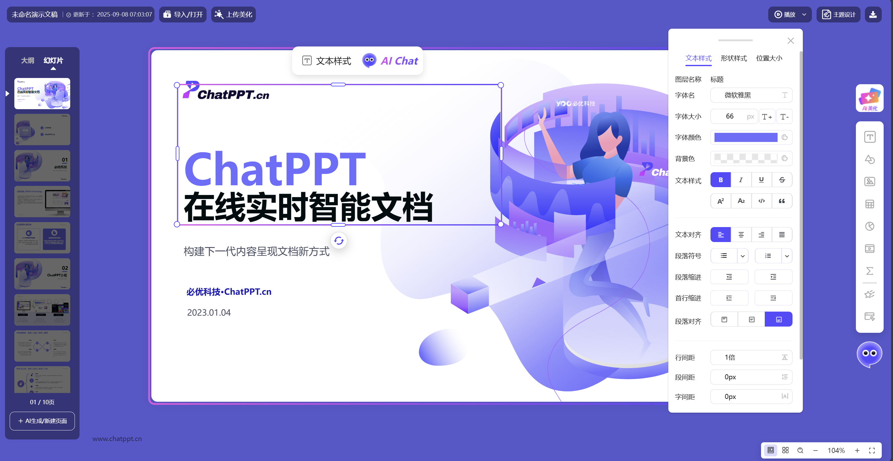

<p align="center">

</p>

<p align="center"><span style="font-size: 40px; font-weight: bold;">OpenPPT</span><br><span style="font-size: 14px;color:#646464;">Powerby ChatPPT</span></p>
<h5 align="center"></h5>
<p align="center">
<a href="./README_zh.md">中文简体 </a> | English
</p>
<p align="center">
    <a href="https://open.chatppt.cn?channel=github-openppt" target="_blank">🔗 Live Demo</a>
    <span>&nbsp;&nbsp;•&nbsp;&nbsp;</span>
    <a href="#-core-features" target="_blank">📝 Introduction</a>
    <span>&nbsp;&nbsp;•&nbsp;&nbsp;</span>
    <a href="https://www.chatppt.cn" target="_blank">🌏 HomePage</a>
    <span>&nbsp;&nbsp;•&nbsp;&nbsp;</span>
    <a href="#-business-cooperation">💬Cooperation</a>
</p>

# ✨ OpenPPT
> OpenPPT, an intelligent PPT application based on web-based services for online presentations, aims to provide full-process creation services for Office slides through online web pages. It supports the entire process of PPT creation from blank creation (import), editing (text/lines/shapes/images/tables/charts/formulas/web pages/notes, etc.), beautification layout, playback, presentation, animation display, to export and download. Moreover, in terms of document format, it is compatible with mainstream Office products including Microsoft, Kingsoft WPS, OpenOffice, etc., easily enabling the import and conversion of mainstream Office document files into online documents, while also supporting the export of online creations to Office formats. Additionally, the product deeply integrates unique intelligent services including AI generation, AI-assisted writing, AI presentation, AI layout beautification, etc. into the application, allowing users to easily experience intelligent office services.
 
 > The core services of the project originate from the product www.chatppt.cn, and the project will continuously follow its iterative versions, meaning that in terms of core functionality and experience, it will strive to achieve alignment and open-source upgrades as much as possible. Therefore, please stay tuned and feel free to propose your project requirements at any time.

<b>👉 Example Experience: https://open.chatppt.cn?channel=github-openppt</b>

---

# 💻 Product Interface
The product supports both PC computers and mobile devices. Below are some screenshots of the open-source version.

**🎉 PC Version**

Editor  



Playing  


Video Demo（Import/Beautify Slide/Player）

[演示视频](./static/demo02.mp4)

[演示视频](./static/demo03.mp4)

[演示视频](./static/demo01.mp4)

**🎉 Mobile**  


---
# 📚 Core Features
## 1️⃣ Generation (New/Import)
### 1. PPT Documents
- Import files (upload local pptx files, compatibility rate above 93%)
- New file (blank) 
- AI-generated documents (AI generates PPT documents based on input topics)

### 2. Slide Pages
- Add blank (right-click, Enter)
- Create from template

### 3. Page Elements
- AI Images: Current version only opens AI-generated image elements (automatically generates images based on page content)

## 2️⃣ Editing
### 1. PPT Documents
- Theme settings (theme font, theme color)
- Default styles (text style, graphic style)
- Size settings (16:9, and custom)

### 2. Slide Pages
- Add, delete, order (drag and drop)
- Copy/Paste/Cut
- Page sections (add/delete/rename)
- Reset clear
- Background settings (background color/background image/background gradient)

### 3. Page Elements
#### 📝 Element Editing (Text/Lines/Shapes/Images/Tables/Charts/Video/Audio/Formulas/Web Pages/Notes)
- Add, delete, move
- Copy, paste
- Floating toolbar (quick access)
- Element position
- Element size, lock aspect ratio
- Element angle
- Element selection (box selection, click selection, Ctrl multi-selection)
- Group, ungroup
- Batch editing
- Element lock
- Snap alignment (drag snap)
- Layer: Move up/down/Bring to front/Send to back
- Align to canvas, element alignment (Top/Bottom/Left/Right/Horizontal Center/Vertical Center)
- Even distribution: Horizontal/Vertical
- Flip: Horizontal flip, Vertical flip
- Hyperlink: Link to web page, link to slide page
- Text style
- Shape style
- Line style
- Text format brush
- Shape format brush
- AI-assisted writing: Polish/Refine/Continue writing/Expand writing/Translation

#### 🧾 Text Properties (Text/Shapes/Tables)
- Text settings: Font (Chinese font/Western font), Font size, Color, Highlight background color
- Basic styles: Bold, Italic, Underline, Strikethrough, Subscript/Superscript, Inline code, Quote
- Text alignment: Left/Right/Center/Justify
- Paragraph symbols: Symbol style, Numbering style
- Paragraph indentation: Increase/Decrease
- Paragraph style: First-line indent
- Paragraph alignment: Top/Bottom/Vertical center
- Text spacing: Line spacing, Paragraph spacing (Before/After), Character spacing
- Text box settings: Shrink text on overflow, Adjust text box based on text

#### 🩰 Shape Style (Text/Shapes)
- Fill color: Color, Transparency, Type (Solid color, Gradient, Image)
- Gradient Settings: Gradient Angle, Gradient Point, Gradient Color, Gradient Method (Linear Gradient, Radial Gradient)
- Image filling: Image settings, Filling method (Stretch and tile)
- Border type: None, Solid border, Dashed border
- Transparency: Element Transparency
- Customize drawing shapes
- Change shape (Preset shape, Local SVG, Online SVG, SVG code)
- Shape Text
- Control point (Special preset type)

#### 🪒 Border Style (Text/Lines/Shapes/Images/Tables)
- Border style: None, Solid border, Dashed border
- Border lines: Solid color lines, Gradient lines
- Line gradient: Gradient angle, Gradient point, Gradient color
- Transparency: Element transparency

#### ➰ Line Style (Lines/Shapes)
- Line style: None, Solid border, Dashed border 
- Start point style: None, Dot, Arrow
- End point style: None, Dot, Arrow
- Line color
- Line width
- Line method: Straight line, Polyline, Connector, Curve

#### 🔰 Shadow Style (Text/Lines/Shapes)
- Shadow type: Enable shadow
- Horizontal shadow
- Vertical shadow
- Blur distance
- Shadow color: Color and transparency

#### 🌇 Image Style (Images)
- Image library (from online gallery)
- Upload local images
- Crop image: Custom
- Crop shape: Preset shape, Custom, Crop ratio
- Image flip: Horizontal/Vertical
- Image tint: Color/Transparency
- Image filter: Blur, Brightness, Contrast, Grayscale, Saturation, Hue, Opacity
- Set image as background
- Reset image
- Image rounded corners

#### 📅 Table Style (Tables)
- Insert table (specify rows and columns), Insert row, Insert column
- Delete rows and columns
- Table style: Three-line table/Ordinary table
- Table background: Transparent table, Filled table
- Table emphasis: First row, First column, Last row, Last column
- Cell settings: Merge/Unmerge
- Cell text (Font, Font size, Color, Background color, Text style)
- Cell data entry
- Border settings

#### 📉 Chart Style (Charts)
- Chart type settings: Column chart, Bar chart, Line chart, Area chart, Pie chart, Doughnut chart
- Stack settings
- Series color: Settings, Add multiple color schemes
- Label settings: Position, Display (Value, Category name, Percentage)
- Legend position
- Use smooth lines
- Chart background color: No background/Color settings
- Data editing

#### 📺 Video Style (Video)
- Video library: Online video library (supports insertion, preview) 
- Upload local video
- Parse online video
- Video cover settings
- Reset video cover
- Play settings: Auto-play
- Change video
- Play video: Auto-play, Loop play, Speed, Sound

#### 💽 Audio Style (Audio)
- Audio library: Online audio library (supports insertion, preview) 
- Upload local audio
- Parse online audio
- Icon settings (Preset shape)
- Icon color
- Play settings: Auto-play, Loop play
- Change audio

#### ♓ Formula Style (Formula)
- Formula library: Preset and common formula library
- Custom formula: LaTex formula
- Formula color
- Formula text drawing width
- Change formula

#### 🌏 Interactive Web Style (Web Page)
- Interactive web library: Online example web pages
- Web address
- Web frame style: None, Browser, Computer, Phone
- Interaction method: Embedded interaction, Click pop-up interaction
- AI-generated web page: Real-time input and generation

## 3️⃣ Beautification Layout
### 1. Upload File Beautification
- Upload local ppt files for intelligent beautification layout

### 2. Full-Text Layout Beautification
- Full-text real-time preview layout
- Supports retaining theme colors, Enabling real-time deep beautification, Supports AI real-time drawing
- Apply to entire document with one click

### 3. Single-Page Layout Beautification
- Single-page real-time preview layout
- Automatically follow theme colors
- Enable real-time deep beautification: Supports manual switching of page types
- Supports AI real-time drawing

## 4️⃣ Playback
### 1. Presentation Playback
- View playback: Normal view/Presenter view
- Page transition animation
- Presentation mode (Click-through, Focus)
- Thumbnail navigation
- Speaker notes
- Countdown (Timer mode, Countdown, Display numbers)
- Laser pointer
- Drawing tools (Pen, Color, Highlighter, Erase)
- Black/white background
- Loop playback, Auto-play
- Full-screen mode/Non-full-screen playback
- Save playback parameters

### 2. View Switching
- Normal view
- Thumbnail browsing view
- Content traceability view

## 5️⃣ Presentation
### 1. Notes
- Add page notes

### 2. Speech Draft
- AI-generated presentation (Single page, Full text)

## 6️⃣ Animation
### 1. Create Animation
- Interactive animation
- Interactive elements

### 2. Interactive Web Page
- Web page settings
- Interaction method (in playback view)

## 7️⃣ Export Download
### 1. Export File
- Export PDF, Long image
- Export pptx file (Compatible with Office software, compatibility rate above 93%)

### 2. Publish and Share (To be opened)
- Share shared page (Online sharing, Collaborative editing)
- Publish roadshow page (Real-time roadshow)

## 8️⃣ Mobile Version
### 📱 Basic Services
#### 1. Document Editing
- PPT Documents
    - Views: Browse view, Edit view, Playback view
    - Upload and beautify PPT (One-click upload local files to beautify PPT)
- Slide Pages:
    - Add, Delete, Copy, Move
    - Redo/Undo
    - Page background: Solid color, Image (Local image)
    - AI layout (Single-page layout/Full-text layout)
- Page Elements:
    - Basic editing: Copy, Delete, Hyperlink
    - Element addition: Text, Shapes (Preset), Images
    - Speaker notes
    - Text style: Font, Color, Font size (Specified, Fine-tune), Background color, Style (Bold, Italic, Underline, Strikethrough), Text alignment (Left, Right, Center, Justify)
    - Shape style: Fill color, Shape
    - Image settings: Replace image
    - Position and size: Position (Specified, Fine-tune), Size, Angle, Layer
    - Alignment: Top, Bottom, Left, Right, Horizontal center, Vertical center

#### 2. Document Playback
- Playback
    - Page switching
    - Swipe playback
    - Browse thumbnails
- Views
    - Normal playback and viewer view
    - Display speaker notes
- Timer

### 🚨 Voice Services
- AI Dialogue: Supports voice conversation creation
    - Voice command interaction
    - Supports functions like beautification layout

## 9️⃣ Other Features
🔤 **1. Multilingual**
- Supports multilingual configuration for the editor. Currently supports Simplified Chinese, Traditional Chinese, and English.
  
  
  
  
  - Chinese configuration: lang=zh-CN (Default)
  - English configuration: lang=en-US

🧼 **2. Copy and Paste**
- Slides
    - Copy, Paste, Cut pages
    - Supports shortcuts
- Page Elements
    - Copy, Paste, Cut all page elements
    - Supports shortcuts
- Special Content
    - Copy image: Copy external element images for insertion, Paste images or fill images (without changing style)
    - Copy html: For web pages, supports copying url or html code to directly update and upload pages
    - Copy SVG: For graphic elements, supports copying SVG url or SVG code to replace vector shapes

🔎 **3. Find/Replace**
- Find: Find strings (Supports case matching, case sensitivity settings)
- Replace: Replace strings (Supports case matching, case sensitivity settings)

📇 **4. Creation Canvas**
- Grid lines
- Guidelines (Page guidelines)
- Smart alignment lines
- Canvas size (Proportion size, Zoom)
- Supports drag and drop (Drag external content for insertion)

📜 **5. Element List**
- Element order
- Element lock
- Element hide
- Element rename

🩸 **6. Right-click Menu**
- Slides
    - Thumbnail - Right-click menu operations
    - Page - Right-click menu
    - Playback page - Right-click menu
- Page Elements
    - Basic elements (Text/Lines/Shapes/Images/Tables/Charts/Video/Audio/Formulas/Web Pages) - Right-click menu
    - Content elements (Tables) - Table operation right-click menu

💡 **7. Shortcuts**
| Category | Shortcut | Function | Notes |
| :------: | :------ | :---- | :---- |
| &#x2705;**Slides** |  |  |  |
|  | **Ctrl+S** | Save | Save document (requires save block connection) |
|  | **PageUp** or **↑** | Up | Select up |
|  | **PageDown** or **↓** | Down | Select down |
|  | **Enter** | New blank page | After selecting page thumbnail |
|  | **Delete** | Delete selected page | After selecting page thumbnail |
|  | **Ctrl** | Multi-select | Mouse + Ctrl click to multi-select pages |
|  | **Shift** | Range select | Mouse + Shift area select pages |
|  | **Ctrl+C** | Copy | Copy page |
|  | **Ctrl+X** | Cut | Cut page |
|  | **Ctrl+V** | Paste | Paste page |
|  | **Ctrl+Z** | Undo | Global shortcut, undo operation |
|  | **Ctrl+Y** | Redo | Global shortcut, redo operation |
|  | **Ctrl+F** | Find and replace | Open find and replace dialog |
| &#x1f504; **Elements** |  |  |  |
|  | **↑** | Move element | Move up |
|  | **↓** | Move element | Move down |
|  | **←** | Move element | Move left |
|  | **→** | Move element | Move right |
|  | **Delete** | Delete element | After selecting element |
|  | **Ctrl** | Multi-select | Mouse + Ctrl click to multi-select elements |
|  | **Shift** | Range select | Mouse + Shift area select elements |
|  | **Ctrl+G** | Group | Group elements |
|  | **Ctrl+C** | Copy | Copy element |
|  | **Ctrl+X** | Cut | Cut element |
|  | **Ctrl+V** | Paste | Paste element |
|&#x23f3; **Playing** |  |  |  |
|  | **F5** | Play | Start from beginning |
|  | **Shift+F5** | Play current | Start from current slide |
|  | **Double-click** | Play selected | Start from selected slide |
|  | **↑** or **←** | Previous | Previous slide |
|  | **↓** or **→** | Next | Next slide |
|  | **Home** | First | Jump to first slide |
|  | **End** | Last | Jump to last slide |
|  | **ESC** | Exit | End presentation |

---
# 🚀 Development and Operation
## 💻 Download Source Code
```
git clone https://github.com/YOOTeam/OpenPPT.git ./OpenPPT
```

Github: https://github.com/YOOTeam/OpenPPT

## 🎉 Run and Start
```
npm install
npm run dev
```
Access: http://localhost:5173/

---

# 🔔 Acknowledgements
The foundation of this project comes from [**PPList**]( https://github.com/pipipi-pikachu/PPTist). Thank you very much to the original author and the open source community for sharing and contributing to the project. 

In order to improve user experience and enhance product integrity, the upgraded features of this project are defined as follows:
> <b> 🔥 Series 1: [Experience and Interaction Upgrade]</b>

Optimization and redefinition have been carried out in interface vision, user interaction, element creation, etc., introducing the current mainstream online web application interaction design, redefining and integrating from three aspects: visual, interactive, and functional.


> <b> 🔥 Series 2: IO Module Upgrade</b>

To ensure comprehensive compatibility of Office files and based on the characteristics of online presentations, this project has introduced presentation feature modules including interactive animation, interactive web pages, native copying, multi view, etc., breaking through the limited interaction element classes and obscure animation classes defined by traditional Office, allowing users to easily express content logic in a brilliant way.

> <b> 🔥 Series 3: [Featured Demonstration Module]</b>

Based on the characteristics of online presentations, this project has newly introduced presentation feature modules including interactive animation, interactive web pages, native replication, multi view, etc., breaking through the limited interactive element classes and obscure animation classes defined by traditional Office, which can make it easier for users to complete the brilliant expression of content logic.

> <b> 🔥 Series 4: [Featured AI Creation Module]</b>

In addition to upgrading the basic online editing services, the project has also introduced a lightweight AI creation module in the creation process to meet the needs of AI creation tools. Including modules such as AI generation, AI typesetting, AI assisted writing, AI speech, AI animation, AI sharing, AI roadshow, etc., and independently packaged with SDK services, integration parties or developers can use them with one click and low threshold.

In short, the implementation of this project will change due to changes in underlying technology and user scenarios. You can also choose a version for integration or secondary development according to your own needs. We welcome everyone to communicate more and contribute to a more prosperous open source ecosystem, promoting the AI evolution of Office software.

---
# 💎 Business Cooperation
 - This project is only for communication and learning purposes, and the project protocol is [**AGPL-3**](https://www.gnu.org/licenses/agpl-3.0.html) Prohibit closed source commercial use, please respect open source.
- If you have relevant commercial needs, you can contact us for * * commercial authorization * *; We also have a dedicated commercial AI PPT software version that supports APIs, proxy services, system integration, private deployment, and other methods.
  
  **🏟 Enterprise Portal**: http://www.yoo-ai.com  
  **📖 API Documentation**: http://wiki.yoo-ai.com

---

# ⏰ About Us
The project team is conducting open source releases for the BiYOO Technology team. BiYou Technology is a vertical AI document product team in China, formerly known as the Kingsoft Office WPS Intelligent Document Incubation Team, with many years of product and technical experience in the Office document field. We are committed to exploring new ways of creating official documents on behalf of others.

With the help of the open-source ecosystem community, we sincerely invite more friends to communicate, cooperate, and co create.

📧 Contact: zhangjiameng@yoojober.com  
🌐 Community:  

